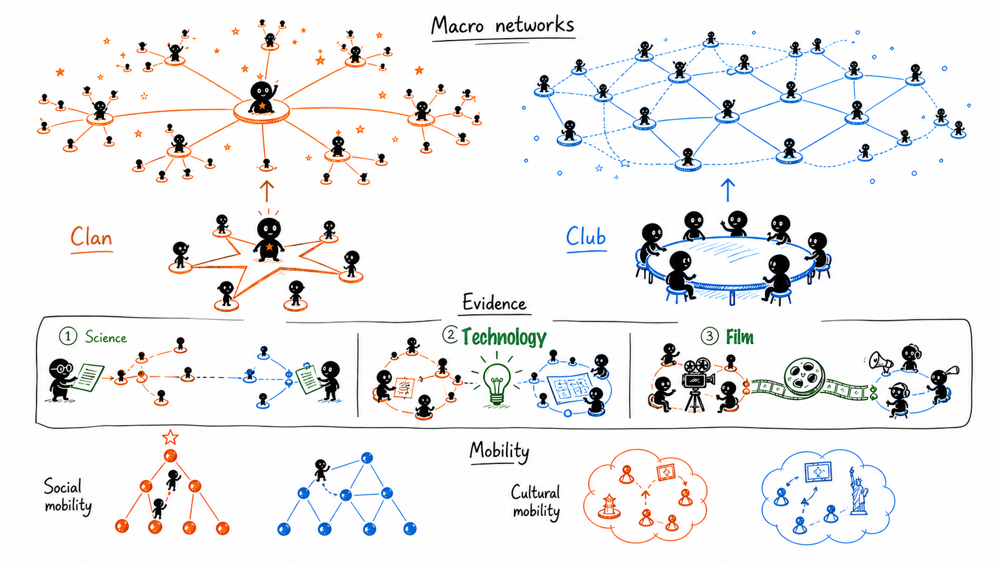

# Innovation Networks in China and the U.S.

A research repository on how national cultures shape innovation networks and their
consequences for mobility and cultural diversity.

<p align="center">
  
</p>

Local cultures shape how people organize relationships, build communities, and generate
new ideas across science, technology, and film. Drawing on theories of Chinese clan-like
hierarchies and U.S. club-like egalitarian associations, this project examines
how small-group social forms scale into macro innovation networks and how these networks
shape social mobility and cultural mobility.

## System Requirements

The original analysis environment was tested on:

- Red Hat Enterprise Linux 8.4 (Ootpa)
- Python 3.9.19

No non-standard hardware is required for the provided scripts, although full-scale analyses
may require access to the original large datasets and computing environment.

## Installation

Clone the repository and create a clean Python environment:

```bash
git clone https://github.com/Yuanyi-Zhen/Innovation_networks_CN_US.git
cd Innovation_networks_CN_US
python -m venv .venv
source .venv/bin/activate
pip install -r requirements.txt
```

## Data

The repository includes 12 processed CSV files in `data/` for inspection:

| File group | Files |
| --- | --- |
| Network features | `science_net.csv`, `technology_net.csv`, `movie_net.csv` |
| Social mobility | `science_social_mobility.csv`, `technology_social_mobility.csv`, `movie_social_mobility.csv` |
| Domain cultural mobility | `science_cultural_mobility_domain.csv`, `technology_cultural_mobility_domain.csv`, `movie_cultural_mobility_domain.csv` |
| Person-level cultural mobility | `science_cultural_mobility_person.csv`, `technology_cultural_mobility_person.csv`, `movie_cultural_mobility_person.csv` |

## Code Organization

The scripts are organized around the main analytical steps of the study:

| Scripts | Purpose |
| --- | --- |
| `generate_simulation_network.py` | Generates ideal-type clan, club, and random networks. |
| `network_features.py` | Calculates structural features of empirical and simulated networks. |
| `social_mob_build_rolling_window_network.py`, `social_mob_analysis.py` | Builds rolling-window collaboration networks and measures changes in network position. |
| `cultural_mob_specter2_paper_embedding.py`, `cultural_mob_Paecter_patent_embedding.py`, `cultural_mob_openai_movie_embedding.py` | Generates text embeddings for science, patent, and movie records. |
| `cultural_mob_domain_distance.py`, `cultural_mob_person_across_time_papar_distance.py` | Computes cultural-mobility distances and breadth measures across domains and individuals. |
| `plot_density_combine.py`, `plot_largest_component.py` | Produces manuscript-style figures from processed analytical outputs. |

## License

This project is licensed under the MIT License. See `LICENSE` for details.
